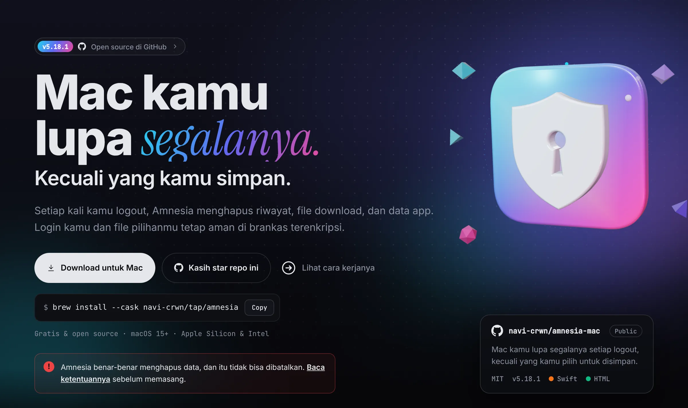
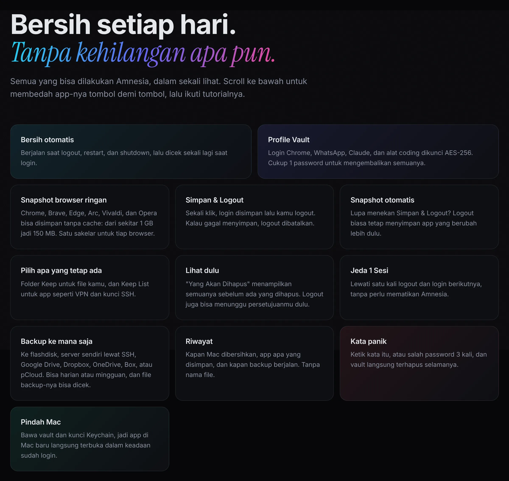
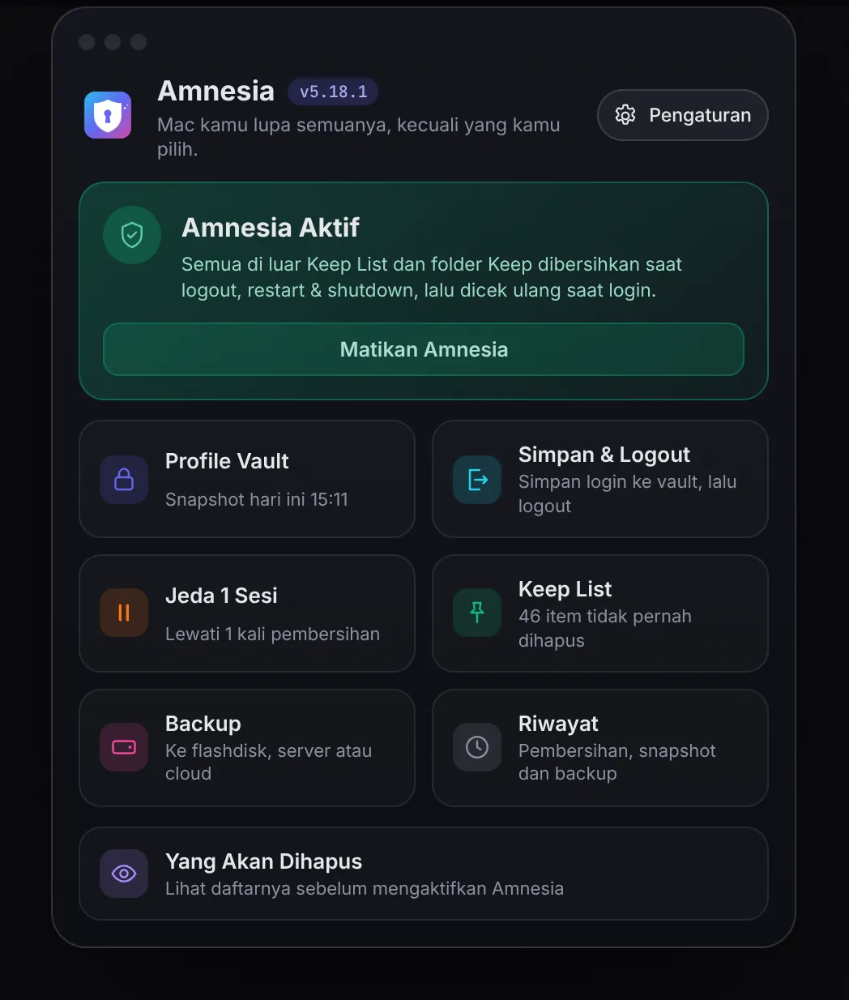
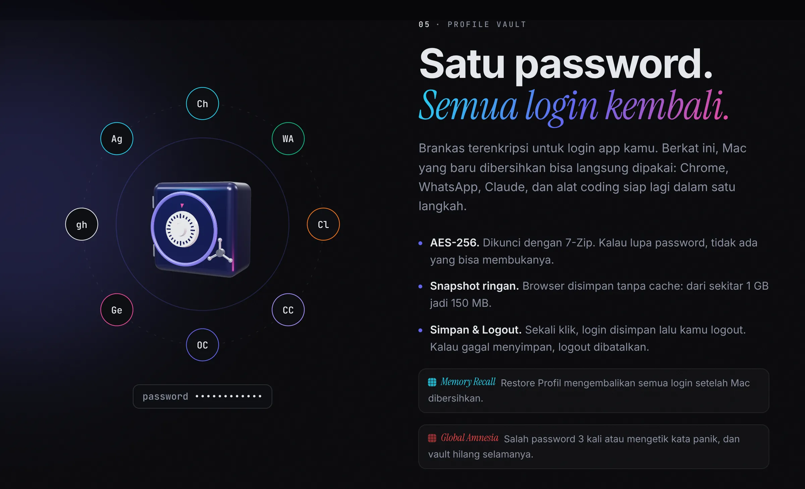
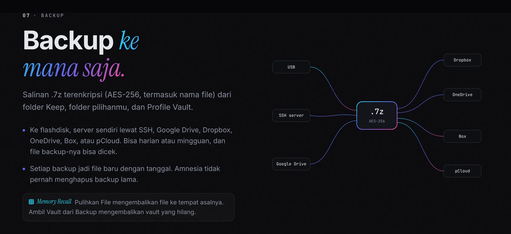
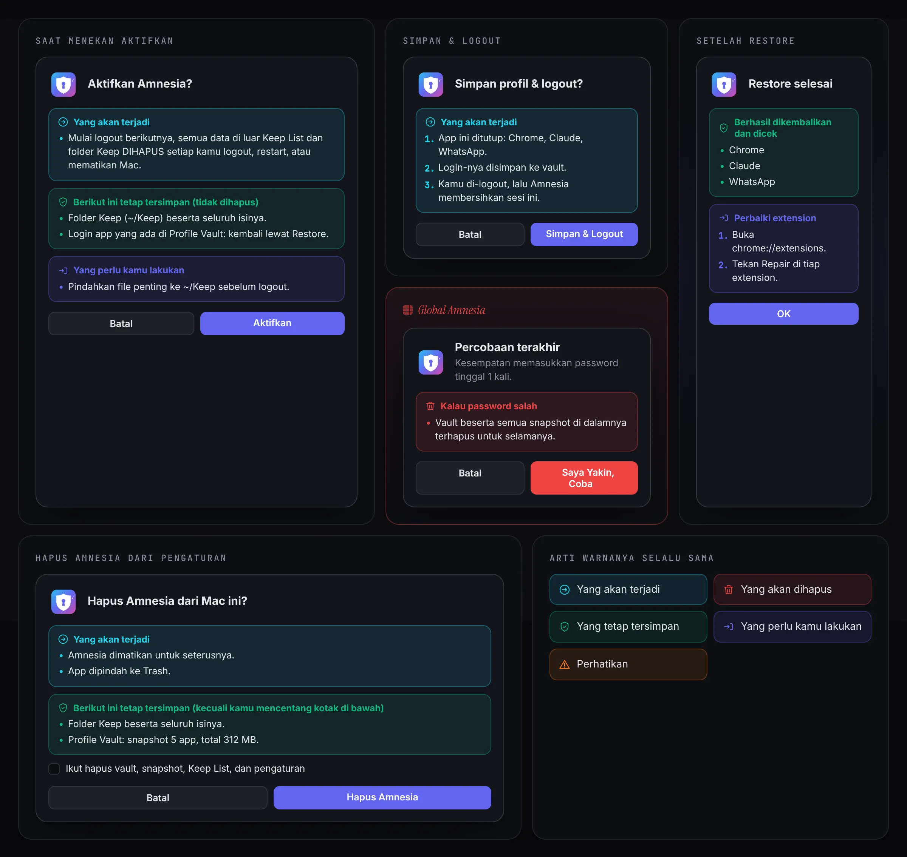
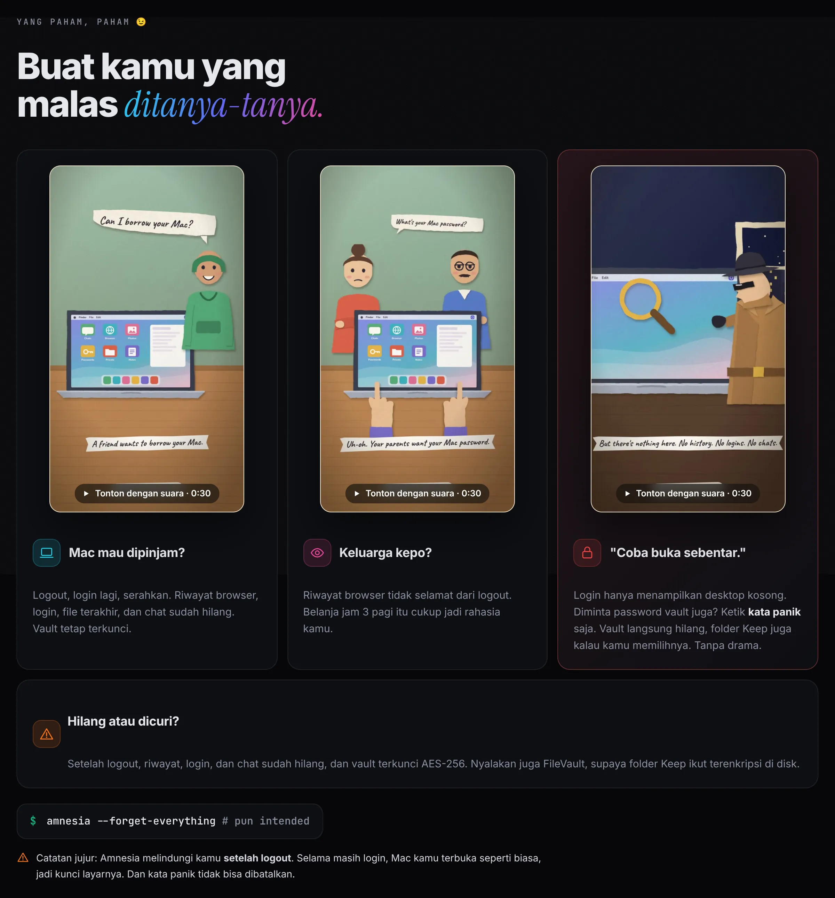

<p align="center"><a href="README.md">English</a> · <b>Bahasa Indonesia</b></p>

<p align="center"><picture><source media="(prefers-color-scheme: light)" srcset="docs/readme/hero-id-light.webp"></picture></p>

<p align="center">
  <b>Setiap kali kamu logout, Mac kamu lupa semuanya.<br>Kecuali yang memang kamu mau simpan.</b>
</p>

<p align="center"><a href="https://navi-crwn.github.io/amnesia-mac/#film"></a><br><sub>▶ Tonton cerita lengkap 54 detik, dengan suara, di <a href="https://navi-crwn.github.io/amnesia-mac/#film">website</a></sub></p>

<p align="center">
  <a href="../../releases/latest"><b>⬇️ Download app</b></a> ·
  <a href="https://navi-crwn.github.io/amnesia-mac/">Website</a> ·
  <a href="#cara-pasang">Cara pasang</a> ·
  <a href="#pertanyaan-umum">FAQ</a> ·
  <a href="#cara-hapus">Cara hapus</a> ·
  <a href="CHANGELOG.id.md">Changelog</a> ·
  <a href="TERMS.id.md">Ketentuan</a>
</p>

> [!WARNING]
> **Amnesia benar-benar menghapus data.** Setelah aktif, semua yang ada di luar folder Keep dan Keep List dihapus setiap logout, restart dan shutdown. Tidak masuk Trash dan tidak bisa dibatalkan. Baca dulu [ketentuan & peringatan](TERMS.id.md) yang singkat ini sebelum memasang.

---

## Apa itu Amnesia?

Bayangkan Mac kamu seperti meja kerja. Setiap selesai kerja, Amnesia **membereskan mejanya sampai bersih**: riwayat browser, cookie, file download, cache, riwayat Terminal, semuanya hilang. Besok kamu mulai lagi dari meja yang rapi, tanpa jejak kemarin.

Masalahnya, kalau semua hilang, kamu harus login ulang Gmail, WhatsApp, Telegram, dan lain-lain setiap hari. Itu bisa makan 15–20 menit. Karena itu Amnesia punya **Profile Vault**: brankas terkunci yang menyimpan login-login kamu. Habis login ke Mac, cukup ketik **1 password**, dan semua login kembali seperti semula.

**Cocok untuk kamu yang:**
- memakai Mac bersama orang lain, atau di tempat umum,
- tidak mau ada jejak kerja yang tertinggal,
- ingin Mac tetap ringan dan bersih setiap hari.

<p align="center"><picture><source media="(prefers-color-scheme: light)" srcset="docs/readme/features-id-light.webp"></picture></p>

<p align="center"><picture><source media="(prefers-color-scheme: light)" srcset="docs/readme/app-id-light.webp"></picture></p>

📖 **Cerita lengkap, tutorial yang bisa diikuti, dan FAQ:** [navi-crwn.github.io/amnesia-mac](https://navi-crwn.github.io/amnesia-mac/)

<details>
<summary><b>Lihat lebih dekat</b></summary>

<p align="center"><picture><source media="(prefers-color-scheme: light)" srcset="docs/readme/vault-id-light.webp"></picture></p>
<p align="center"><picture><source media="(prefers-color-scheme: light)" srcset="docs/readme/backup-id-light.webp"></picture></p>
<p align="center"><picture><source media="(prefers-color-scheme: light)" srcset="docs/readme/popups-id-light.webp"></picture></p>
<p align="center"><picture><source media="(prefers-color-scheme: light)" srcset="docs/readme/private-id-light.webp"></picture></p>

</details>

## Apa yang dihapus, apa yang aman?

| 🗑️ Dihapus setiap logout | ✅ Tetap aman |
|---|---|
| Riwayat & cookie browser | Isi **folder Keep** kamu (bawaannya `~/Keep`; boleh di mana saja, nama apa saja) |
| Isi Desktop, Downloads, Documents, Pictures | Login yang disimpan di **Profile Vault** |
| Cache, log, riwayat Terminal | Semua yang ada di **Keep List** (VPN, kunci SSH, setting Terminal, dll.) |
| Data app yang tidak kamu pilih | App yang terpasang di `/Applications` dan Homebrew |
| | Akun Apple, Foto, Notes, Mail, Messages dan lainnya (kartu **Akun & data Apple**, menyala secara default) |

Mau tahu persis apa yang akan dihapus **tanpa menghapus apa pun**? Di app, tekan **Yang Akan Dihapus** di halaman utama. Atau jalankan:

```bash
bash ~/.amnesia/clean.sh logout --dry-run
```

## Fitur

- **🛡️ Bersih otomatis.** Pembersihan berjalan **sebelum** Mac logout, restart, atau shutdown. Saat login berikutnya Amnesia mengecek ulang, jadi kalau ada yang terlewat, ikut dibersihkan.
- **🔐 Profile Vault.** Login Chrome (Gmail, WhatsApp Web, Telegram Web), Claude, WhatsApp, dan alat coding seperti Claude Code, OpenCode, Gemini CLI, GitHub CLI disimpan dalam brankas terenkripsi (AES-256). Untuk memulihkan, cukup 1 password. Browser Chromium lain (Brave, Edge, Vivaldi, Arc, Opera) bisa ditambahkan dengan 1 klik.
- **🪶 Snapshot ringan, per browser.** Kartu **Snapshot ringan** di Profile Vault punya tombol untuk tiap browser. Nyala (bawaan): cache browser dan file program extension dari Web Store tidak ikut disimpan, jadi snapshot jauh lebih kecil dan cepat; login, bookmark dan pengaturan tetap tersimpan, dan setelah Restore kamu tinggal tekan *Repair* di tiap extension. Mati: semuanya disimpan. Simpan & Logout dan snapshot otomatis mengikuti tombol yang sama.
- **⏏️ Simpan & Logout.** 1 klik: login kamu disimpan dulu ke vault, baru Mac logout. Kalau penyimpanannya gagal, logout dibatalkan, jadi tidak ada yang hilang.
- **⏸️ Jeda 1 Sesi.** Butuh Mac tidak dibersihkan sekali saja? Tekan Jeda. Setelah 1x logout dan login, Amnesia aktif lagi sendiri.
- **📌 Keep List.** Pilih folder atau app yang tidak boleh ikut dihapus, langsung dari app. Nyalakan sebuah app dan kamu lihat persis apa yang disimpan (data app, setting, ukurannya).
- **🗂️ Folder Keep milikmu.** File di dalamnya tidak pernah dihapus. Taruh di mana saja (bahkan di drive eksternal) dan beri nama apa saja.
- **💾 Backup ke mana saja.** Folder pilihan dikunci jadi 1 file `.7z` (AES-256), lalu dikirim ke:
  - **Flashdisk / SSD** yang tercolok,
  - **Server sendiri / VPS** lewat SSH + rsync. Ketik password server sekali, Amnesia yang menyiapkan kuncinya. Tanpa Terminal.
  - **Cloud**: Google Drive, Dropbox, OneDrive, Box atau pCloud. Login lewat browser, tanpa Terminal. (S3, WebDAV dan 40+ lainnya lewat rclone.)
- **⏰ Backup terjadwal.** Harian atau mingguan, jalan sendiri selama ikon Amnesia ada di menu bar. Tombol **Jalankan backup terjadwal sekarang** untuk langsung mengetesnya.
- **🔎 Cek file backup.** Pilih file backup `.7z`, lalu Amnesia membukanya di folder sementara untuk memastikan vault di dalamnya bisa dipulihkan. Vault kamu yang sekarang tidak berubah sama sekali. Kalau password salah atau file-nya tidak berisi vault, pesannya bilang dengan jelas.
- **↩️ Pulihkan File.** Pilih file atau folder dari backup, lalu Amnesia mengembalikannya ke tempat asalnya. File yang sudah ada di sana dipindah dulu ke `~/.amnesia/before-restore`, tidak pernah ditimpa. Mau taruh di tempat lain? Tekan **Ke Folder Lain**.
- **🕘 Riwayat.** Halaman yang mencatat setiap pembersihan, snapshot, restore dan backup, dikelompokkan per hari. Isinya hanya waktu dan nama app, tidak pernah nama file kamu.
- **🚚 Pindah Mac.** Bawa semua login ke Mac baru: kunci Keychain ikut disimpan ke vault, vault ikut ke backup, lalu dipulihkan di Mac baru.
- **👋 Tur perkenalan.** Saat pertama dibuka, Amnesia mengajak kamu keliling, cek semua sudah siap, mendeteksi app kamu, lalu tanya mana yang datanya mau disimpan.
- **🔥 Tombol darurat.** Kalau password vault salah 3x, atau kamu mengetik *kata panik* yang sudah kamu atur, vault langsung dimusnahkan.
- **👀 Cek dulu sebelum logout.** Logout atau restart lewat menu Apple ditahan sebentar, lalu kamu lihat dulu apa saja yang akan dihapus. Lanjut atau batal, kamu yang pilih. Daftarnya disiapkan di background, jadi langsung tampil.
- **🏠 Offline & privat.** Tanpa server, tanpa akun, tanpa pelacakan, tanpa pengumpulan data. Tidak ada yang keluar dari Mac kamu kecuali kamu sendiri yang mengatur backup.
- **📸 Snapshot otomatis.** Lupa menekan Simpan & Logout? Saat logout, restart atau shutdown biasa, Amnesia tetap menyimpan app yang datanya **berubah** sejak snapshot terakhirnya (maksimal 150 detik, supaya Mac tidak tertahan lama). App yang kamu matikan di vault dilewati. Kalau waktunya habis, snapshot lama app itu tetap aman.
- **🎨 Peringatan yang jelas.** Setiap popup dibagi jadi kotak berwarna: *Yang akan terjadi* (biru), *Yang akan dihapus* (merah), *Berikut ini tetap tersimpan (tidak dihapus)* (hijau) dan *Yang perlu kamu lakukan* (ungu).
- **🔔 Notifikasi.** Setelah login, Amnesia memberi tahu bahwa Mac sudah bersih dan mengingatkan untuk restore profil.
- **⚙️ Pengaturan.** Semua fitur di atas bisa dinyalakan atau dimatikan sesukamu.
- **🌐 2 bahasa.** English atau Bahasa Indonesia, tinggal pilih di Pengaturan.
- **🟢 Ikon di menu bar.** Status Amnesia selalu terlihat di pojok kanan atas: hijau aktif, oranye jeda, merah mati. Tombol besar **Aktifkan / Matikan** ada langsung di kartu status halaman utama.

## Cara pasang

**Yang dibutuhkan:** macOS 15 atau lebih baru. Sisanya sudah ada di dalam app (termasuk 7-Zip). Kalau Command Line Tools Apple (gratis) belum ada, tur perkenalan bantu memasangnya, dan minta **Akses Disk Penuh** sekali saja (supaya macOS tidak tanya per folder).

**Sebelum apa pun:** baca [ketentuan & peringatan](TERMS.id.md). App juga meminta kamu mencentang bahwa kamu sudah membacanya.

**Cara 1: Homebrew** (paling gampang, update cukup `brew upgrade`)

```bash
brew install --cask navi-crwn/tap/amnesia
```

**Cara 2: Installer (.dmg)**

1. Ambil `Amnesia-vX.dmg` dari [Releases](../../releases/latest), buka, lalu seret **Amnesia** ke folder **Applications**. Di dalamnya ada file `READ ME FIRST` berisi peringatan singkat.
2. App ini belum ditandatangani Apple, jadi macOS memblokirnya pertama kali. Buka sekali, lalu ke **System Settings → Privacy & Security** dan klik **Open Anyway**.
   Atau lewat Terminal: `xattr -dr com.apple.quarantine /Applications/Amnesia.app`

**Cara 3: Build sendiri** (butuh Command Line Tools)

```bash
git clone https://github.com/navi-crwn/amnesia-mac.git ~/.amnesia
bash ~/.amnesia/app/build.sh
```

**Mau uninstall:** buka Pengaturan lalu tekan *Hapus Amnesia*. Lihat bagian [Cara hapus](#cara-hapus) di bawah.

## Cara pakai pertama kali

Tur perkenalan akan memandu kamu, tapi singkatnya begini:

1. **Buat vault.** Buka *Profile Vault*, isi password (minimal 12 karakter), lalu tekan *Buat Vault*. Password ini **tidak bisa dipulihkan** kalau lupa, jadi simpan baik-baik.
2. **Simpan login.** Login ke Chrome, WhatsApp, dan app lain seperti biasa, lalu tekan *Snapshot*.
3. **Amankan file.** Pindahkan file yang penting ke folder Keep kamu (`~/Keep`, atau di mana pun kamu menaruhnya).
4. **Cek dulu.** Buka Pengaturan (⚙️) → **Lihat yang akan dihapus sekarang**, pastikan tidak ada yang penting di daftar.
5. **Aktifkan.** Tekan *Aktifkan* di kartu status halaman utama. Mulai logout berikutnya, Mac kamu akan selalu bersih.

**Sehari-hari:** logout lewat tombol **Simpan & Logout**. Saat login lagi, buka Profile Vault dan tekan **Restore Profil**.

## Glosarium

Istilah ini hanya dipakai di teks ini dan di website. Tombol di app tetap memakai nama biasanya.

- **Selective Amnesia**: pembersihan normal saat logout. Semua dihapus kecuali Keep List, folder Keep dan Profile Vault.
- **Global Amnesia**: semuanya hilang tanpa jalan kembali. Ini terjadi lewat tombol panik (Doomsday), lewat Uninstall kalau kamu mencentang *hapus vault juga*, atau saat dibersihkan padahal tidak punya snapshot maupun backup.
- **Memory Recall**: mengembalikan yang tersimpan. Yaitu Restore Profil, Ambil Vault dari Backup, Pindah Mac dan Pulihkan File.

## Pertanyaan umum

**Apa bedanya Keep List dan Profile Vault?**
Keep List untuk hal yang tidak rahasia dan boleh tetap ada (misalnya setting VPN). Profile Vault untuk login dan data pribadi: disimpan terkunci, dan baru bisa dibuka dengan password.

**Kalau saya logout lewat menu Apple, bagaimana?**
Aman. Amnesia menahan sebentar untuk menunjukkan apa yang akan dihapus, lalu menyimpan login kamu ke vault secara otomatis sebelum membersihkan. Kedua fitur ini bisa dimatikan di Pengaturan.

**Kalau lupa password vault?**
Vault tidak bisa dibuka siapa pun, termasuk kamu. Hapus vault, buat yang baru, lalu login ulang ke app-app kamu.
Kalau masih ingat dan cuma mau ganti: Profile Vault → **Password**. Snapshot tetap aman.

**Snapshot minta password?**
Tidak. Vault mengunci snapshot dengan kunci yang hanya bisa dibuka password kamu, jadi menyimpan tidak perlu password; yang perlu hanya **Restore**. Setiap app punya snapshot sendiri, jadi menyimpan satu app tidak menimpa app lain; yang disimpan hanya yang terbaru per app. App (dan folder) mana yang ikut disimpan bisa kamu pilih di halaman Profile Vault, lengkap dengan ukurannya. Ikon tempat sampah di samping snapshot menghapus snapshot itu saja; **Hapus Semua Snapshot** menghapus semuanya tapi vault dan password tetap. Snapshot, Restore dan Backup bisa dibatalkan; yang sebelumnya tetap aman.

**Apakah data saya dikirim ke internet?**
Tidak. Amnesia tidak punya server, tidak pakai akun, tidak melacak dan tidak mengumpulkan data, jadi memang tidak ada yang dikirim. Satu-satunya pengecualian: backup ke server atau cloud yang **kamu** atur sendiri, dan itu pun cuma file `.7z` terkunci, langsung dari Mac kamu ke tempat yang kamu pilih. Vault dan Keep List pribadi kamu juga tidak ikut ke GitHub.

**Kenapa minta Akses Disk Penuh?**
Untuk membersihkan Desktop, Documents dan Downloads, macOS biasanya minta izin per folder (dan tidak bisa bertanya saat logout). Izinkan sekali di **System Settings → Privacy & Security → Full Disk Access**, selesai. Kalau kamu build sendiri, `build.sh` menandatangani app dengan sertifikat lokal supaya izinnya tidak hilang saat update (build pertama mungkin minta password Mac sekali: tekan **Always Allow**). Pembersihan saat logout juga lewat app, jadi izin yang sama ikut berlaku.

**Backup online, apa yang perlu disiapkan?**
- *Flashdisk atau folder:* pilih flashdisk atau folder mana saja (misalnya drive jaringan).
- *Server SSH:* isi `user@alamat` atau `user@alamat:folder` (port lain: isi kolom Port, atau tulis `user@alamat:port`), ketik password server **sekali**, tekan **Hubungkan**. Amnesia membuat kunci SSH dan memasangnya di server, tanpa Terminal. Password tidak disimpan; sesudahnya backup login pakai kunci. Sudah punya kunci yang jalan? Kosongkan saja password-nya. Tanpa folder, backup masuk ke `~/amnesia-backup` di server. Hubungkan mengecek folder itu bisa ditulis, menampilkan path lengkapnya, dan mengukur kecepatan supaya kamu tahu kira-kira berapa lama backup.
- *Cloud:* 1. pilih layanannya (Dropbox, OneDrive, Box atau pCloud), 2. tekan **Hubungkan**: halaman login terbuka di browser bawaan (Safari kalau belum memilih browser). Login lalu tekan Allow / Izinkan, 3. tulis nama folder. Kalau browser tidak terbuka, layar tunggu punya tombol untuk membuka halaman login. Amnesia memasang rclone sendiri (butuh Homebrew).
- *Google Drive:* paling mudah lewat app gratis **Google Drive for Desktop**: Amnesia menyalin backup ke foldernya dan app itu yang mengunggah. Mau langsung tanpa app? Pakai client ID Google milikmu sendiri di **Lanjutan** (ada panduan langkah demi langkah di app).

**Cara kerja backup (panduan)** di halaman Backup menjelaskan tiap tujuan, folder yang aman, dan cara mengecek file backup.

Kalau nanti password server diganti, backup tetap jalan (pakai kunci). Backup baru gagal kalau server diinstal ulang atau kuncinya dihapus, dan pesannya akan menyuruh tekan **Hubungkan** lagi.

Catatan jujur: setiap backup dikirim utuh (bukan hanya bagian yang berubah), karena filenya terenkripsi. Backup lama tidak dihapus otomatis, jadi sesekali bersihkan sendiri di tujuan.

**Cara membuka file backup?**
Kalau di-klik dua kali, yang terbuka adalah Archive Utility, dan app itu tidak bisa membuka `.7z` terkunci seperti ini. Pakai **Keka** (gratis), atau Terminal: `~/.amnesia/bin/7zz x amnesia_backup_xxx.7z`, lalu ketik password backup saat diminta (jangan tulis password di perintahnya). Lebih gampang lagi: Backup → **Pulihkan File** di app.

**Cara mengambil beberapa file saja dari backup?**
Backup → **Pulihkan File…**: pilih file `.7z`, ketik password backup, centang yang mau dikembalikan, lalu tekan **Pulihkan ke Lokasi Asal**. File yang sudah ada di sana dipindah dulu ke `~/.amnesia/before-restore/`. Kalau tempat asalnya drive eksternal yang tidak tercolok, Amnesia minta kamu memilih folder lain. Catatan: selama Amnesia nyala, file yang dipulihkan di luar Keep List akan terhapus lagi saat logout berikutnya, jadi pindahkan ke folder Keep.

**Cek file backup bilang "tidak berisi Profile Vault". Backup saya rusak?**
Tidak. File-nya bisa dibuka; hanya saja dibuat saat *Sertakan Profile Vault* mati (atau sebelum v5.13). File kamu ada di dalamnya, vault-nya saja yang tidak. Kalau pesannya password tidak cocok, file-nya juga baik-baik saja, hanya password-nya beda.

**Backup terjadwal minta password Mac. Kenapa?**
Password backup disimpan di Keychain, dan yang menyimpannya versi app yang lama. Ketik password Mac sekali dan tekan **Always Allow**; Amnesia lalu menyimpannya ulang atas nama versi sekarang, jadi tidak ditanya lagi.

**Pindah ke Mac baru, langkahnya?**
Buka Profile Vault → **Pindah Mac** (atau dari Pengaturan). Halamannya memandu langkah demi langkah:
1. Di Mac lama: **Siapkan Pindah** (klik *Always Allow* di dialog macOS).
2. Backup dengan **Sertakan Profile Vault** dicentang.
3. Di Mac baru: pasang Amnesia, buka halaman Pindah Mac → **Ambil Vault dari Backup**.
4. **Restore Profil**, lalu **Pulihkan Kunci**. Chrome, Claude, dan WhatsApp terbuka dengan login lama.

**Bisa cek apakah backup benar-benar bisa dipakai?**
Bisa. Backup → **Cek file backup**: pilih file `.7z`, ketik password backup, lalu Amnesia membuka vault-nya di folder sementara, menampilkan ukuran, tanggal dan daftar app-nya, lalu menghapus salinan sementara itu. Vault kamu yang sekarang tidak disentuh.

**Di mana saya bisa lihat apa yang sudah dilakukan Amnesia?**
Halaman utama → **Riwayat**. Isinya pembersihan (berapa item), jeda, snapshot, restore, backup dan tombol darurat, per hari. Nama file tidak pernah dicatat.

**Bagaimana mematikannya?**
Tekan *Matikan* di kartu status halaman utama. Mac berhenti dibersihkan sampai kamu aktifkan lagi.

## Cara hapus

Cara paling gampang: buka **Pengaturan** di app lalu tekan **Hapus Amnesia**. Prosesnya bertahap:
1. Popup menjelaskan apa yang akan terjadi dan apa saja yang masih tersimpan (vault, snapshot di dalamnya, Keep List dan pengaturan).
2. Ada kotak centang **Hapus juga vault, snapshot, Keep List, dan pengaturan** (bawaannya tidak dicentang). Biarkan kosong kalau mau disimpan untuk nanti.
3. Kalau kamu mencentangnya, ada konfirmasi kedua sekali lagi. File-file itu dipindah ke Trash, tidak langsung hilang.
4. Amnesia dimatikan untuk seterusnya dan app-nya dipindah ke Trash. Folder Keep kamu tidak pernah disentuh.

Terlanjur menyeret Amnesia ke Trash? Itu juga aman: Amnesia tahu, mematikan dirinya sendiri dan tidak membersihkan apa pun lagi.

Lebih suka Terminal? Tempel ini:

```bash
bash ~/.amnesia/uninstall.sh
```

Script ini mematikan agent login lebih dulu (supaya waktu dihentikan tidak ada yang terhapus), menghentikan Amnesia, menghapus app, lalu mengecek tidak ada yang tersisa. Vault dan pengaturan di `~/.amnesia` tetap disimpan, kalau nanti mau pasang lagi. Folder Keep kamu tidak pernah disentuh.

- Mau hapus semuanya, termasuk vault? Pakai `bash ~/.amnesia/uninstall.sh --all` (kamu diminta mengetik `HAPUS` dulu).
- Pasang lewat Homebrew? `brew uninstall --cask amnesia` menjalankan langkah aman yang sama.
- Tidak ada folder `~/.amnesia`? Berarti Amnesia belum pernah jalan, jadi script tidak perlu: hapus app-nya saja.

## Untuk yang penasaran (teknis)

| File | Fungsinya |
|---|---|
| `clean.sh` | Penghapus utama. Membaca `keep.conf` (Keep List milikmu). |
| `agent.sh` | Dijalankan macOS saat login, lalu "berjaga" untuk membersihkan saat logout. |
| `vault.py` | Profile Vault: kunci RSA-4096 + 7-Zip AES-256. |
| `backup.sh` | Backup terenkripsi ke flashdisk, server SSH, atau cloud (rclone). |
| `keep.example.conf` | Contoh Keep List. `build.sh` menyalinnya jadi `keep.conf` saat pertama dipasang. |
| `app/` | Kode app SwiftUI, ikon, dan script build/rilis. `app/screenshots.sh` memotret app asli dengan data contoh (opsional). |
| `docs/` | Website (GitHub Pages). `docs/readme/` berisi gambar README yang diambil dari website. |
| `test_clean.sh`, `test_vault.py`, `test_backup.sh` | Tes otomatis di "home palsu", aman dijalankan kapan saja. |

---

<p align="center">Lisensi MIT · <a href="TERMS.id.md">Ketentuan & peringatan</a> · Pakai dengan bijak: Amnesia benar-benar menghapus data.</p>
