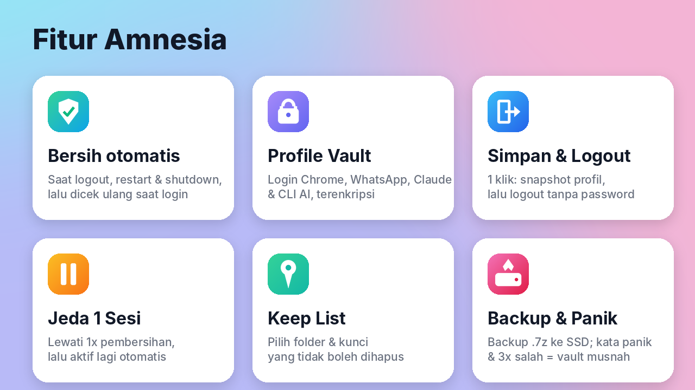
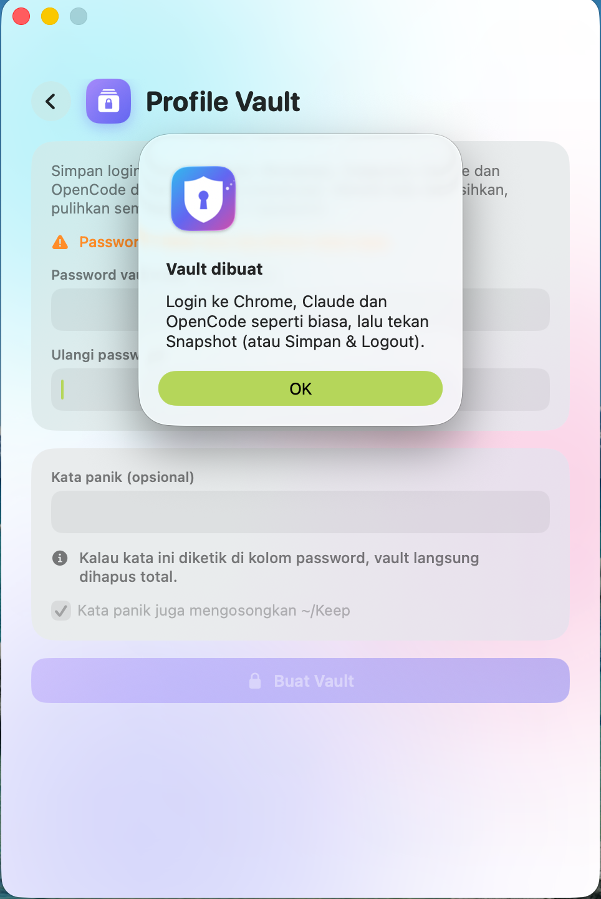

<p align="center"></p>

<p align="center">
  <b>Setiap kali kamu logout, Mac kamu lupa semuanya.<br>Kecuali yang memang kamu mau simpan.</b>
</p>

<p align="center">
  <a href="../../releases/latest"><b>⬇️ Download app</b></a> ·
  <a href="#cara-pasang">Cara pasang</a> ·
  <a href="#pertanyaan-umum">FAQ</a> ·
  <a href="CHANGELOG.md">Changelog</a>
</p>

---

## Apa itu Amnesia?

Bayangkan Mac kamu seperti meja kerja. Setiap selesai kerja, Amnesia **membereskan mejanya sampai bersih**: riwayat browser, cookie, file download, cache, riwayat Terminal, semuanya hilang. Besok kamu mulai lagi dari meja yang rapi, tanpa jejak kemarin.

Masalahnya, kalau semua hilang, kamu harus login ulang Gmail, WhatsApp, Telegram, dan lain-lain setiap hari. Itu bisa makan 15–20 menit. Karena itu Amnesia punya **Profile Vault**: brankas terkunci yang menyimpan login-login kamu. Habis login ke Mac, cukup ketik **1 password**, dan semua login kembali seperti semula.

**Cocok untuk kamu yang:**
- memakai Mac bersama orang lain, atau di tempat umum,
- tidak mau ada jejak kerja yang tertinggal,
- ingin Mac tetap ringan dan bersih setiap hari.

<p align="center"></p>

## Apa yang dihapus, apa yang aman?

| 🗑️ Dihapus setiap logout | ✅ Tetap aman |
|---|---|
| Riwayat & cookie browser | Isi folder **`~/Keep`** (taruh file pentingmu di sini) |
| Isi Desktop, Downloads, Documents, Pictures | Login yang disimpan di **Profile Vault** |
| Cache, log, riwayat Terminal | Semua yang ada di **Keep List** (VPN, kunci SSH, setting Terminal, dll.) |
| Data app yang tidak kamu pilih | App yang terpasang di `/Applications` dan Homebrew |

Mau tahu persis apa yang akan dihapus **tanpa menghapus apa pun**? Jalankan:

```bash
bash ~/.amnesia/clean.sh logout --dry-run
```

## Fitur

- **🛡️ Bersih otomatis.** Pembersihan berjalan **sebelum** Mac logout, restart, atau shutdown. Saat login berikutnya Amnesia mengecek ulang, jadi kalau ada yang terlewat, ikut dibersihkan.
- **🔐 Profile Vault.** Login Chrome (Gmail, WhatsApp Web, Telegram Web), Claude, WhatsApp, dan alat coding seperti Claude Code, OpenCode, Gemini CLI, GitHub CLI disimpan dalam brankas terenkripsi (AES-256). Untuk memulihkan, cukup 1 password.
- **⏏️ Simpan & Logout.** 1 klik: login kamu disimpan dulu ke vault, baru Mac logout. Kalau penyimpanannya gagal, logout dibatalkan, jadi tidak ada yang hilang.
- **⏸️ Jeda 1 Sesi.** Butuh Mac tidak dibersihkan sekali saja? Tekan Jeda. Setelah 1x logout dan login, Amnesia aktif lagi sendiri.
- **📌 Keep List.** Pilih folder atau app yang tidak boleh ikut dihapus, langsung dari app.
- **💾 Backup.** Salin folder pilihan ke SSD atau flashdisk dalam bentuk file terkunci password.
- **🔥 Tombol darurat.** Kalau password vault salah 3x, atau kamu mengetik *kata panik* yang sudah kamu atur, vault langsung dimusnahkan.
- **🟢 Ikon di menu bar.** Status Amnesia selalu terlihat di pojok kanan atas: hijau aktif, oranye jeda, merah mati.

<p align="center"></p>

## Cara pasang

**Yang dibutuhkan:** macOS 15 atau lebih baru, [Homebrew](https://brew.sh), dan Command Line Tools (gratis, pasang dengan `xcode-select --install`).

Buka **Terminal**, lalu tempel:

```bash
brew install sevenzip python
git clone https://github.com/navi-crwn/amnesia-mac.git ~/.amnesia
bash ~/.amnesia/app/build.sh
```

Amnesia akan terbuka sendiri dan muncul di Launchpad.

## Cara pakai pertama kali

1. **Buat vault.** Buka *Profile Vault*, isi password (minimal 12 karakter), lalu tekan *Buat Vault*. Password ini **tidak bisa dipulihkan** kalau lupa, jadi simpan baik-baik.
2. **Simpan login.** Login ke Chrome, WhatsApp, dan app lain seperti biasa, lalu tekan *Snapshot*.
3. **Amankan file.** Pindahkan file yang penting ke folder `~/Keep`.
4. **Cek dulu.** Jalankan perintah dry-run di atas dan pastikan tidak ada yang penting di daftar.
5. **Aktifkan.** Tekan *Aktifkan*. Mulai logout berikutnya, Mac kamu akan selalu bersih.

**Sehari-hari:** logout lewat tombol **Simpan & Logout**. Saat login lagi, buka Profile Vault dan tekan **Restore Profil**.

## Pertanyaan umum

**Apa bedanya Keep List dan Profile Vault?**
Keep List untuk hal yang tidak rahasia dan boleh tetap ada (misalnya setting VPN). Profile Vault untuk login dan data pribadi: disimpan terkunci, dan baru bisa dibuka dengan password.

**Kalau saya logout lewat menu Apple, bagaimana?**
Mac tetap dibersihkan, tapi login terbarumu **tidak** ikut disimpan. Karena itu biasakan pakai tombol *Simpan & Logout*.

**Kalau lupa password vault?**
Vault tidak bisa dibuka siapa pun, termasuk kamu. Hapus vault, buat yang baru, lalu login ulang ke app-app kamu.

**Apakah data saya dikirim ke internet?**
Tidak. Semua berjalan di Mac kamu sendiri. Vault dan Keep List pribadi kamu juga tidak ikut ke GitHub.

**Bagaimana mematikannya?**
Tekan *Matikan* di app. Mac berhenti dibersihkan sampai kamu aktifkan lagi.

## Untuk yang penasaran (teknis)

| File | Fungsinya |
|---|---|
| `clean.sh` | Penghapus utama. Membaca `keep.conf` (Keep List milikmu). |
| `agent.sh` | Dijalankan macOS saat login, lalu "berjaga" untuk membersihkan saat logout. |
| `vault.py` | Profile Vault: kunci RSA-4096 + 7-Zip AES-256. |
| `keep.example.conf` | Contoh Keep List. `build.sh` menyalinnya jadi `keep.conf` saat pertama dipasang. |
| `app/` | Kode app SwiftUI, ikon, dan script build/backup. |
| `test_clean.sh`, `test_vault.py` | Tes otomatis di "home palsu", aman dijalankan kapan saja. |

---

<p align="center">Dibuat untuk pemakaian pribadi. Pakai dengan bijak: Amnesia benar-benar menghapus data.</p>
